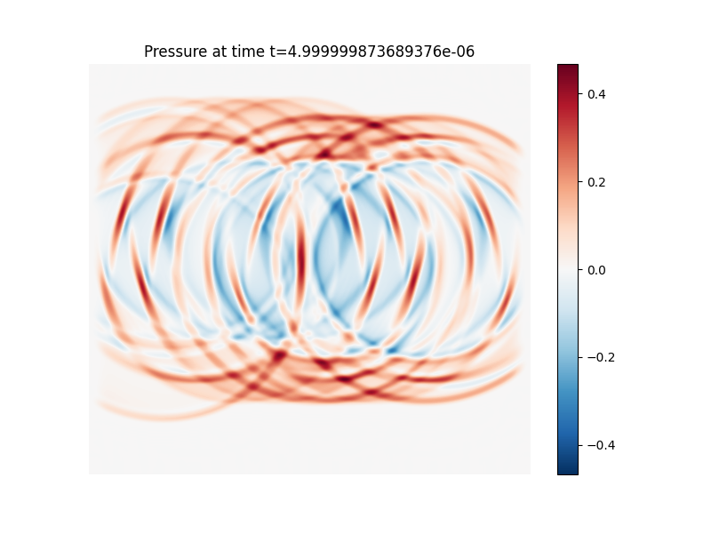

<div align="center">
</img>
</div>

# j-Wave: Differentiable acoustic simulations in JAX

[](LICENSE)
[](https://github.com/ucl-bug/jwave/actions/workflows/main.yml)
[](https://codecov.io/gh/ucl-bug/jwave)
[](https://ucl-bug.github.io/jwave)
[](https://mybinder.org/v2/gh/ucl-bug/jwave/main?labpath=docs%2Fnotebooks%2Fivp%2Fhomogeneous_medium.ipynb)

[Install](#install) | [Tutorials](https://ucl-bug.github.io/jwave/notebooks/ivp/homogeneous_medium.html) | [Documentation](https://ucl-bug.github.io/jwave) | [Changelog](HISTORY.md)

j-Wave is a library of simulators for acoustic applications. Is heavily inspired by [k-Wave](http://www.k-wave.org/) (a big portion of j-Wave is a port of k-Wave in JAX), and its intented to be used as a collection of modular blocks that can be easily included into any machine learning pipeline.

Following the phylosophy of [JAX](https://jax.readthedocs.io/en/stable/), j-Wave is developed with the following principles in mind

1. To be differntiable
2. To be fast via `jit` compilation
3. Easy to run on GPUs
4. Easy to customize

<br/>

## Install

Follow the instructions to install [Jax with CUDA support](https://github.com/google/jax#installation) if you want to use your GPU.

Then, simply install `jwave` using pip

```bash
pip install git+https://github.com/ucl-bug/jwave.git
```

For more details, see the [Linux install guide](docs/install/on_linux.md).

Because JAX has limited support on Windows, j-Wave can be run on Windows machines only using the Windows Subsystem for Linux. See the [Install on Windows](docs/install/on_win.md) guide for more details.

<br/>

## Example

This example simulates an acoustic initial value problem, which is often used as a simple model for photoacoustic acquisitions:

```python
from jax import jit

from jwave import FourierSeries
from jwave.acoustics.time_varying import simulate_wave_propagation
from jwave.geometry import Domain, Medium, TimeAxis
from jwave.utils import load_image_to_numpy

# Simulation parameters
N, dx = (256, 256), (0.1e-3, 0.1e-3)
domain = Domain(N, dx)
medium = Medium(domain=domain, sound_speed=1500.)
time_axis = TimeAxis.from_medium(medium, cfl=0.3, t_end=.8e-05)

# Initial pressure field
p0 = load_image_to_numpy("docs/assets/images/jwave.png", image_size=N)/255.
p0 = FourierSeries(p0, domain)

# Compile and run the simulation
@jit
def solver(medium, p0):
  return simulate_wave_propagation(medium, time_axis, p0=p0)

pressure = solver(medium, p0)
```




<br/>

### Citing

A preprint describing the main functionality of j-Wave will be released soon.


<br/>

### Related Projects

1. [`ADSeismic.jl`](https://github.com/kailaix/ADSeismic.jl): a finite difference acoustic simulator with support for AD and JIT compilation in Julia.
2. [`stride`](https://github.com/trustimaging/stride): a general optimisation framework for medical ultrasound tomography.
3. [`k-wave-python`](https://github.com/waltsims/k-wave-python): A python interface to k-wave GPU accelerated binaries
